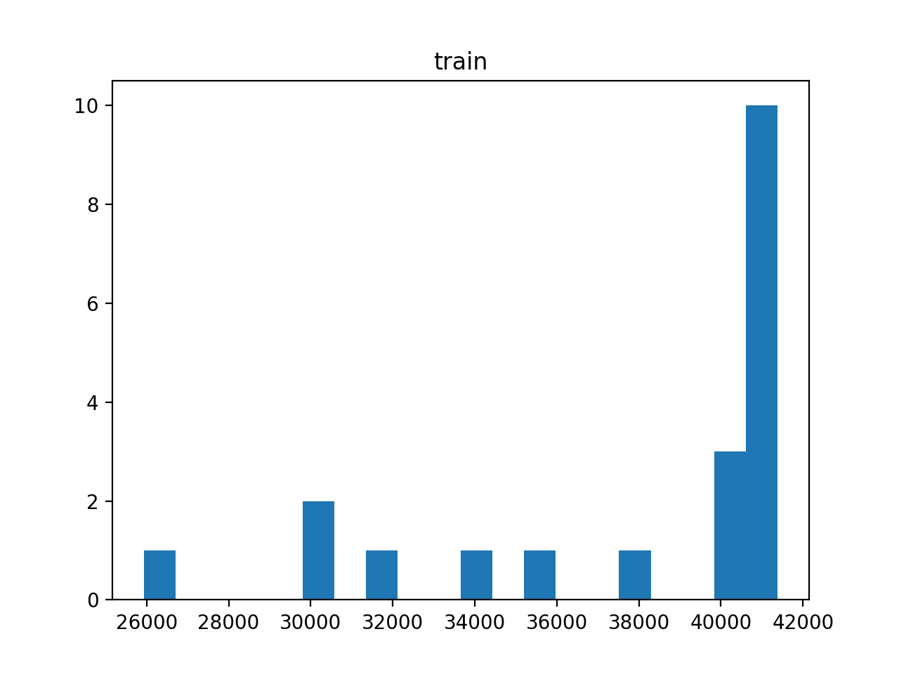

# AI-Stock-Trader
Created an DQN AI Agent with MLP neural network classifier and reinforcement learning which chooses to sell, buy, or keep stocks from various companies. This AI agent was made with Tensorflow's Keras API, Pandas, Numpy, and Sklearn. This Agent chooses whether to buy/sell/keep stocks from Apple, Starbucks, and Motorola Solutions. The agent was able to achieve a profit of $20916.63 in 20 episodes of trading stocks. The Agents more in depth stats after 20 episodes: Average Value of Portfolio: 37719.69, Min Value of Portfolio: 25937.29, Max Value of Portfolio: 41378.68. By Henry Boisdequin


Histogram: This image shows the value of the Agents portfolio as the number of episodes increased.

Needed Modules:
```
pip install tensorflow
pip install pandas
pip install numpy
pip install sklearn
```

To Run:
```
To Train: python main.py -m train && python plot_rewards.py -m train
To Test: python main.py -m test && python plot_rewards.py -m test
```

Dataset:
```
aapl_msi_sbux.csv
```

To-do:
- [ ] More visuals on the companies the model invested in
- [ ] Predictions into the future with data from the past year and a web driver that appends data to the csv after each day passes
